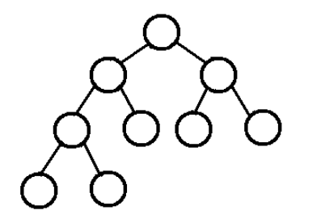
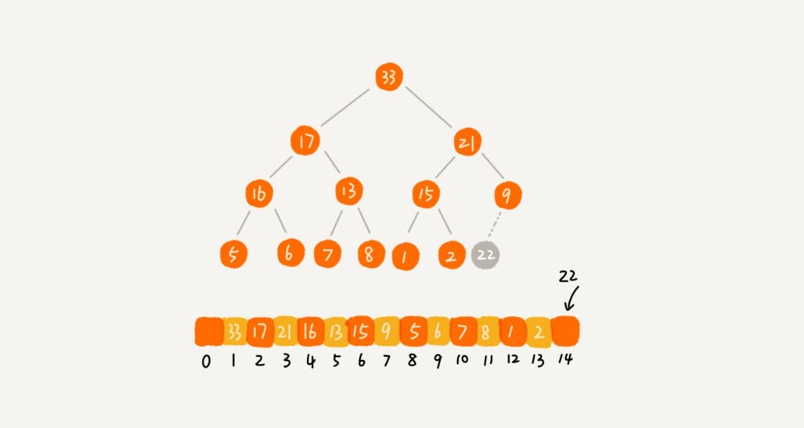

# 学习笔记
## 堆排序
- **什么是堆排序**  

堆排序是指用堆数据结构，设计的一种排序算法。堆的具体实现方式有多种，这里以二叉堆为例，说明堆排序算法的设计原理。  

堆是一种特殊的树结构，需要满足以下条件:           

**a) 堆是完全二叉树：如下图所示，除了最后一层之外的其他每一层都被完全填充，且所有结点都保持向左对齐**  

**b) 堆中每个节点的值都必须大于等于（或小于等于）其子树中的每个节点的值**     

根据堆顶元素大小，堆可分为大顶堆和小顶堆。          

   

- **如何实现一个堆**  

完全二叉树一般用数组实现，不需要存储左右子节点的指针，可以单纯通过数组下标，找到一个节点的左右子节点和父节点。

    

堆的核心操作包括：
- 插入
- 删除

- **如何基于堆实现排序**    

1. 建堆    

尽管数组中包含N个元素，假设起初堆中只有一个元素，就是下标为1的元素，然后调用堆插入操作，将下标从2到N的元素依次插入到堆中。**建堆的时间复杂度为O(N)。**      

2. 排序     

假设大顶堆已经建好，此时数组中的元素已经是按照大顶堆的特性来组织的。数组中的第一个元素，位于堆顶，就是最大的元素。

 堆顶元素与末尾元素交换，此时最大元素位于数组最右侧，即下标为N的位置。   

 通过堆化方式，将剩余N-1个元素重新构建成堆，继续取堆顶元素，放到下标为N-1的位置，一直重复该过程，直到最后堆中只剩下标为1的元素，排序工作结束。

**排序的过程时间复杂度为O(NlogN)。**

综上所述，堆排序的时间复杂度为：O(N)+O(NlogN)，依然是O(NlogN)。

